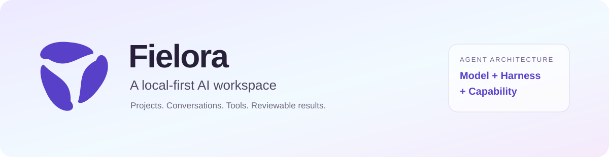
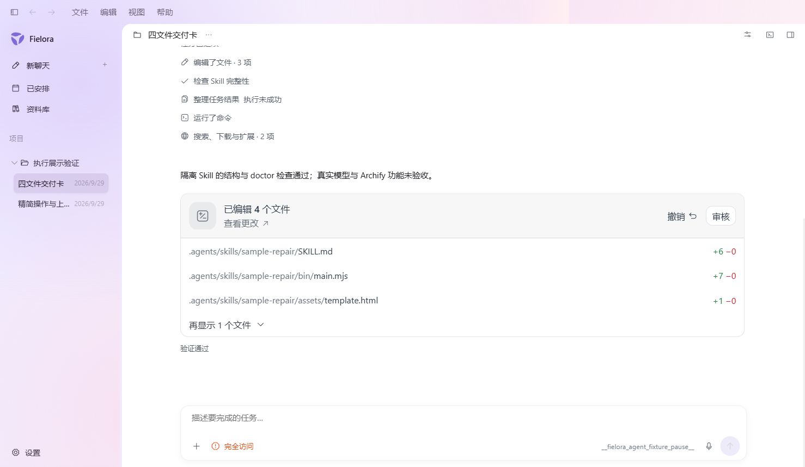
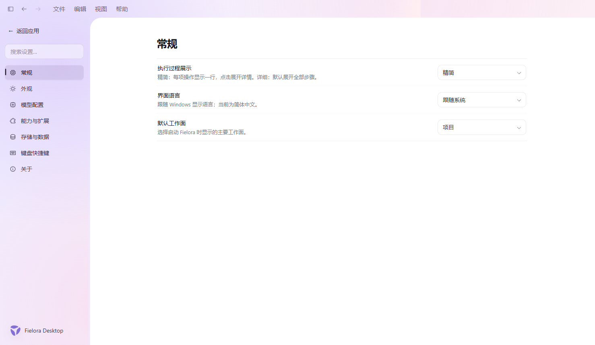
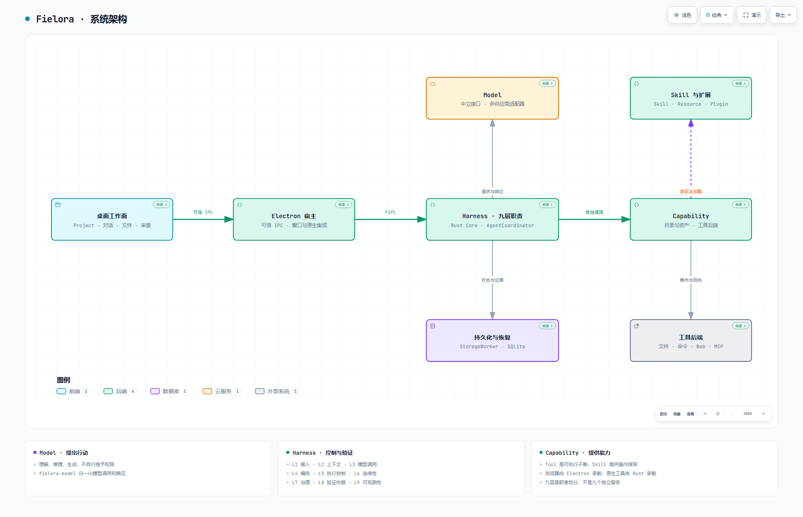

<p align="center">
  
</p>

<p align="center"><strong>以项目为中心，把对话、代码、工具和可审阅的结果放在同一个桌面工作空间。</strong></p>

<p align="center">Windows 11 x64 · 多模型服务 · Rust + React + Electron · Apache-2.0</p>

<p align="center">
  <a href="#快速开始">快速开始</a> · <a href="#功能与体验">功能与体验</a> · <a href="#系统架构">系统架构</a> · <a href="#开发与贡献">开发与贡献</a> · <a href="#当前状态与路线">当前状态与路线</a>
</p>

## Fielora 是什么？

Fielora 是一个 **本地优先、多模型服务的 AI 桌面工作空间**。打开本地项目后，你可以围绕同一份代码持续对话，让 Agent 读取文件、提出并执行修改、运行命令与测试，再查看差异、审阅结果或继续工作。

项目、对话和执行记录保存在本地；模型通过统一接口接入。文件、终端、浏览器和产物工作面按需展开，让对话保持主焦点，也让实际变更有地方检查。

*Fielora is a local-first, project-centered AI desktop workspace with provider-neutral model access, governed tool execution, and reviewable results.*

> **开发状态：V0.1 持续迭代中。** 本页介绍截至 2026-09-29 的[开发分支](https://github.com/Moriaenzhx/Fielora/tree/phase/complete-agent-v0.1)，架构和截图对应源码基线 [7919a64](https://github.com/Moriaenzhx/Fielora/commit/7919a64c4b6aa8409a61fcf4d39aa1b027460415)。默认分支的产品代码可能滞后；体验最新实现请使用下方明确指定的分支。当前正式验证平台是 Windows 11 x64，尚不作稳定版或跨平台交付承诺。

## 功能与体验



<sub>真实 Windows 桌面应用截图，来自 2026-09-29 的隔离测试。图中的项目、任务与模型均为测试样例，用于展示交互；不代表真实模型完成了对应工作。</sub>

| 你要做的事 | Fielora 提供的工作方式 |
| --- | --- |
| 持续处理一个项目 | 本地文件夹与 Project 关联；多个持久对话；重启后回到既有工作记录 |
| 选择合适的模型 | 配置 Provider、Base URL 和 Model ID；支持 OpenAI Responses、Anthropic Messages 与 OpenAI-compatible Chat Completions 适配器 |
| 修改与检查代码 | 项目文件读取、搜索、受控修改、命令执行和测试；文件变更汇总、Diff 审阅与撤销入口 |
| 继续较长的工作 | 暂停、停止、继续、检查点与重启核对；累计执行时间可设为 1–1440 分钟，Token 用于统计而非任务累计额度限制 |
| 看清进度与费用 | 精简 / 详细执行记录、当前动作、工具回执；按实际 Provider / Model 归属的用量和本地价格估算 |
| 检查网页与本地产物 | 隔离浏览器工作面、受控页面观察与交互；文档、演示、图表、表格产物的有界操作 |
| 扩展任务能力 | 项目 Skill 的发现、加载、获取与结构检查；本地声明式插件贡献 Skill；配置并激活本地 MCP stdio 工具 |

功能范围取决于当前准入的工具、配置和权限。模型协议兼容不等于所有模型具备相同的工具调用、视觉理解或长任务质量。

### 从请求到结果


执行过程可以展开查看。需要确认的操作保留明确入口；任务中断时，已完成的操作与尚未验证的结果会分别记录。长时间额度并不关闭单次调用超时、权限检查或无进展保护。

<details>
<summary><strong>查看界面设置</strong>：精简过程、语言与默认工作面</summary>



<sub>同一隔离桌面测试中的真实设置界面。模型服务、用量统计和任务预算集中在“模型配置”中。</sub>

</details>

## 系统架构

Fielora 的 Agent 采用 **Model + Harness + Capability**。桌面宿主、通信与存储为它提供基础设施；它们不是额外的 Agent 层。

<picture>
  <source media="(prefers-color-scheme: dark)" srcset="docs/media/architecture-dark.png" />
  
</picture>

**[查看大图](docs/media/architecture-light.png)** · **[交互版 HTML](docs/diagrams/fielora-architecture.html)** · **[Archify JSON 源文件](docs/diagrams/fielora-architecture.json)** · **[生成与验证说明](docs/diagrams/README.md)**

交互版由 **Archify** 生成，包含明暗主题、缩放、节点来源和图像导出。GitHub 文件页不执行 HTML；下载后用浏览器打开即可。图中连线概括职责关系与主要交互，不表示进程部署边界或仅有单向数据传输。

| 部分 | 负责什么 | 主要实现 |
| --- | --- | --- |
| 桌面工作面 | 项目、对话、文件、Diff、设置与工具工作区 | TypeScript / React |
| Electron 宿主 | 窗口生命周期、受信 IPC、Rust Sidecar 监督、隔离浏览器与原生集成 | Electron / Chromium |
| Model | 理解、推理、生成、提出行动；统一不同供应商协议 | `fielora-model` |
| Harness | 上下文、编排、执行控制、权限审批、连续性、验证恢复与诊断 | `fielora-core` + `fielora-agent` |
| Capability | 工具定义和后端、Skill、资源读取、适配器与插件包装 | Rust 工具实现 + Electron 浏览器后端 |
| 持久化与凭据 | 项目与对话、Run、工具回执和检查点；系统凭据存储 | SQLite / `fielora-storage` / Windows Credential Manager |

Harness 按九类职责组织：**接入 → 上下文 → 模型调用 → 编排控制 → 能力调用与执行控制 → 连续性 → 治理 → 验证恢复 → 可观测性**。这是职责划分，不是九个服务，也不是固定的九步流水线。

模型提出操作，Harness 决定是否允许、是否需要确认以及如何执行，Capability 返回实际结果。**工具执行成功与任务完成分开判断；旧版本的测试结果不能证明新修改已经正确。**

详细边界见[主架构与九层职责](https://github.com/Moriaenzhx/Fielora/blob/7919a64c4b6aa8409a61fcf4d39aa1b027460415/docs/architecture/AGENT_ENGINEERING_VIEWS_V0.1.md)和[完整 Agent 架构规范](https://github.com/Moriaenzhx/Fielora/blob/7919a64c4b6aa8409a61fcf4d39aa1b027460415/docs/architecture/FIELORA_V0.1_AGENT_ARCHITECTURE_SPEC.md)。

## 快速开始

当前建议从源码运行开发版。不要把仓库 `artifacts/` 下的历史阶段程序当作最新发行版。

### 开发环境

| 依赖 | 当前要求 |
| --- | --- |
| 系统 | Windows 11 x64 |
| Node.js | `>=24.18.1 <25`；仓库 `.node-version` 为 `24.18.1` |
| pnpm | `11.21.0` |
| Rust | `1.97.1`，以 `rust-toolchain.toml` 为准 |
| 原生构建 | MSVC C++ 工具链与 Windows SDK |
| 版本管理 | Git |

在 PowerShell 中运行：

```powershell
git clone --branch phase/complete-agent-v0.1 https://github.com/Moriaenzhx/Fielora.git
cd Fielora

node --version
pnpm --version
rustc --version

pnpm install --frozen-lockfile
pnpm dev
```

`pnpm dev` 会先构建 Rust Core，再启动 Electron 开发宿主。首次安装需要访问依赖源及 Electron 下载源。若本机装有多个 Node，请先确认当前终端使用 Node 24.x；使用已有运行时的完整路径也可以，不必卸载其他版本。

macOS Apple Silicon 的本地开发启动与平台适配边界见 [macOS 开发指南](docs/engineering/MACOS_DEVELOPMENT.md)；当前同样跟踪 `phase/complete-agent-v0.1`，不以默认 `main` 作为最新开发版本。

### 第一次使用

1. 打开 **设置 → 模型配置**，添加兼容服务、API Key 与模型标识。
2. 打开本地项目文件夹，创建对话并选择模型。
3. 从明确的小任务开始，例如“解释入口逻辑”或“修复这个函数并运行相关测试”。
4. 检查操作记录与文件 Diff，处理必要的确认，再根据测试结果审阅或继续。
5. 较长任务可在模型配置中调整时间额度。等待人工回答的时间不计入累计执行时间。

调用外部模型需要你自己的服务配置和可用额度；模型费用由对应服务计收。

## 数据与执行边界

- **本地优先**：项目、对话和执行状态由本地 Rust Core / SQLite 持久化。发送给模型的请求仍会离开本机，数据处理遵循你所选服务的政策。
- **凭据独立存储**：API Key 使用 Windows Credential Manager，不应提交到仓库、截图或问题报告。
- **模型不能自行授权**：权限、确认路由与结果验证分离；网页、Skill、MCP 元数据和模型输出不会自动扩大操作范围。
- **浏览器隔离**：远程页面不获得 Node、应用 preload 或本地工作区桥接权限。
- **工具安装按影响处理**：先发现已有运行时。可信官方来源、实际不超过 20 MiB、安装在隔离目录且不改系统 / PATH、不执行安装脚本的小工具可免安装确认；其他安装需要人工确认，网络准入仍单独判断。
- **恢复保留不确定性**：中断且结果未知的副作用不会被直接当成成功，也不会一律盲目重放。

这些机制仍在持续测试和改进，不能理解为通用操作系统沙箱或所有模型行为的安全保证。

## 当前状态与路线

| 范围 | 当前状态 |
| --- | --- |
| 项目 / 对话 / 多模型 / 文件与 Diff / 命令工作流 | 已实现，持续改进桌面体验 |
| 长任务与恢复 | 已有时间额度、暂停继续、检查点与重启核对；真实复杂任务可靠性仍需持续验证 |
| Skill、MCP 与产物能力 | 已有受限实现；具体范围见[能力清单](https://github.com/Moriaenzhx/Fielora/blob/7919a64c4b6aa8409a61fcf4d39aa1b027460415/docs/architecture/CAPABILITY_INVENTORY_V0.1.md) |
| macOS / Linux、本地模型、远程分布式执行、完整插件市场 | 不属于当前 V0.1 交付承诺 |
| Aegis、DXE、Personal Steward | 后续演进方向，依赖稳定工作状态与真实用户流程 |

近期重点是 **完成真实任务、减少重复尝试、保留正确上下文、提高执行与恢复的可解释性**。IDR 已退出生产 Agent 链路，历史代码和数据保留用于兼容与追溯。

截至上述源码基线，Cross 层检查通过；专项桌面验证仍有原生剪贴板往返失败，尚不能宣称完整 PreMerge 全绿。确定性模型替身验证的是机制，不等于真实模型质量认证；此前真实模型的 Archify 原任务仍未完成验收。本页架构图是单独生成并校验的文档产物。

后续路线见[快速桌面交付路线](https://github.com/Moriaenzhx/Fielora/blob/7919a64c4b6aa8409a61fcf4d39aa1b027460415/docs/product/RAPID_DESKTOP_EXECUTION_V0.1.md)。

## 开发与贡献

```text
apps/desktop/            Electron 主进程、React 界面与桌面后端
crates/fielora-core/      Rust Sidecar、任务编排与生命周期
crates/fielora-agent/     上下文、策略、工具接口与执行实现
crates/fielora-model/     模型协议适配与流式响应归一化
crates/fielora-storage/   SQLite、迁移与持久状态
crates/fielora-platform/  平台与凭据集成
crates/fielora-field/     Project / Field 兼容领域模型
crates/fielora-contracts/ 共享 Rust 契约
packages/contracts/      生成的 TypeScript 契约
.agents/skills/           项目 Skill
tests/                   集成、桌面端到端与评估测试
docs/                    产品、架构、工程记录与公开图片
```

常用命令：

```powershell
pnpm dev                 # 开发运行
pnpm build               # 类型检查、Rust Release 与 Windows 桌面打包
pnpm verify:dev:docs      # 文档与上下文清单
pnpm verify:dev:ui        # TypeScript、Lint、界面单元测试
pnpm verify:dev:core      # Rust 格式、测试、Clippy
pnpm verify:dev:cross     # 跨层契约与 Core 集成检查
pnpm verify:premerge      # main 准入检查，含真实桌面 E2E
```

开始修改前请阅读 [AGENTS.md](AGENTS.md) 中的最小当前事实与[开发工作流](https://github.com/Moriaenzhx/Fielora/blob/7919a64c4b6aa8409a61fcf4d39aa1b027460415/docs/engineering/DEVELOPMENT_WORKFLOW_V0.1.md)。普通功能围绕一条可验证的用户流程推进；模型、工具或 UI 的新能力沿现有架构扩展。

欢迎通过 [Issues](https://github.com/Moriaenzhx/Fielora/issues) 提交可复现问题与建议，通过 [Pull Requests](https://github.com/Moriaenzhx/Fielora/pulls) 提交改进。问题报告请包含版本或提交、环境、复现步骤、预期与实际结果；日志与截图请移除凭据和私人内容。

<details>
<summary><strong>更多项目资料</strong></summary>

- [当前项目事实](https://github.com/Moriaenzhx/Fielora/blob/7919a64c4b6aa8409a61fcf4d39aa1b027460415/docs/context/02_PROJECT_REALITY.md)
- [重要决策](https://github.com/Moriaenzhx/Fielora/blob/7919a64c4b6aa8409a61fcf4d39aa1b027460415/docs/context/03_DECISIONS.md)
- [Agent 故障、修复与设计经验](https://github.com/Moriaenzhx/Fielora/blob/7919a64c4b6aa8409a61fcf4d39aa1b027460415/docs/engineering/AGENT_DESIGN_IMPLEMENTATION_LESSONS.md)
- [Fielora Glass 设计语言](https://github.com/Moriaenzhx/Fielora/blob/7919a64c4b6aa8409a61fcf4d39aa1b027460415/docs/product/FIELORA_DESIGN_LANGUAGE_V0.1.md)
- [历史仓库首页与阶段记录](docs/context/REPOSITORY_CONTEXT_LEGACY.md)

历史 Phase / Freeze 文档保留作追溯；与当前方向冲突时，以最新明确决定和当前项目事实为准。

</details>

## 许可证与致谢

Fielora 的源码和文档采用 [Apache License 2.0](LICENSE)，项目署名见 [NOTICE](NOTICE)。第三方依赖及 vendored 材料保留各自许可证。

感谢 Electron、React、Rust、SQLite、CodeMirror、Phosphor Icons 等项目。架构图使用 [Archify](https://github.com/tt-a1i/archify) 生成；其 MIT 许可及相关第三方声明见[图表来源说明](docs/diagrams/README.md)。
